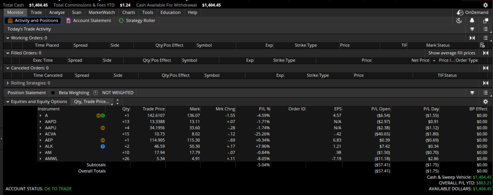
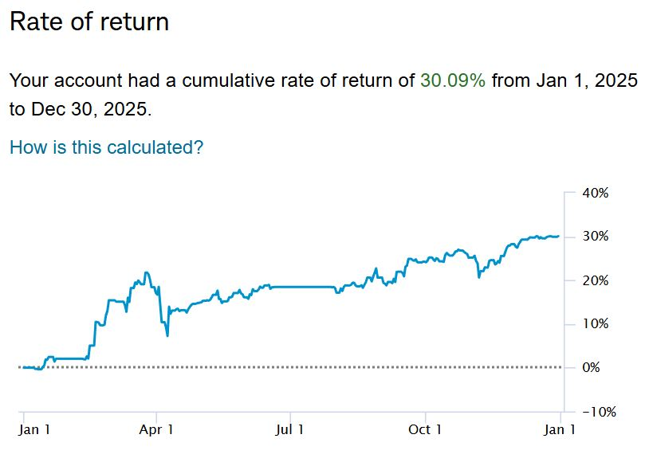

# Loot-Loader

## Overview

**Loot-Loader** is a stock equity trading program for equities, designed to operate using minute historical data to calculate necessary indicators for trading.

The system supports **automated equity trades at market price** under tightly controlled conditions.

Loot-Loader is published as a **reference implementation**.  
This repo is **not a turnkey trading product** and is **not runnable without private infrastructure, credentials, and configuration**.

---

## What Loot-Loader Does

- Ingests historical **minute-level and daily market data**
- Computes and stores enriched indicators, including:
  - EMA200 and EMA200 angle
  - Volatility-normalized statistical bands
  - High–Low Equilibrium Value (HLEV) structures
- Maintains a **time-consistent historical database**
- Accounts for historical EOD data reconciliation
- Evaluates symbols using **weighted signal logic**
- Generates explainable BUY / SELL / HOLD decisions
- **Executes equity trades at market price** when all conditions are met
- Logs trades and decision context for later review

---

## Execution Scope

Loot-Loader includes **equity execution logic**, but execution is:

- Limited to **market orders**
- Bound to a **single authenticated account**
- Dependent on **external OAuth2 authentication**
- Governed by **risk and capital constraints**
- Not exposed as a reusable or distributable interface

This repository does **not** provide a “plug-and-play” trading system. It requires a brokerage account with Charles Schwab as well as application registery. 

---

## What Loot-Loader Does *Not* Do

- ❌ Execute options, futures, or derivatives
- ❌ Provide multi-account or multi-user support
- ❌ Expose broker credentials or secrets
- ❌ Offer configuration suitable for third-party use
- ❌ Guarantee profitability or performance

---

## Technology Stack

schwab-py wrapper
LLLib_Charles_Schwab wrapper (proprietary and not included in this repo)
os
json
datetime
time
traceback

---
## Example Output

The script produces:
- Console output showing each stocks last date of entry and then indicates filling of data to present. 
- The current status of the stock listed.
- True or False indication of whether the indicator comparisons have been met for the stocks particular status.

### Console / Printable Output

These visualizations embody automated decision-making. Stock groups are broken into groups of 85 because it takes ~30 mins to get through 85 stocks with the ping limitation set forth by Schwab at 240/min. 

This system utilizes 9 instances of the same program to look at 765 stocks every 30 minutes. This is a first version of the program. The next version with include async practices and be reduced in size and iteration to accomplish the same task.

The progress, displayed below, is the schwab account on ThinkOrSwim as well as the portfolio performance which shows a the programs capability in a good stock market year. More testing is needed to see if the current indicator combination is a good fit or not. The 30% account performance was with one instance of the program (not all 9).

---